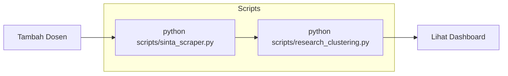

# Presentasi Laboratorium Inovasi Digital

Dashboard presentasi untuk Laboratorium Inovasi Digital yang menampilkan data Tridarma Dosen terintegrasi dengan SINTA 3.

## 🌟 Fitur Utama

### 1. Dashboard SINTA
- Visualisasi data publikasi, penelitian, pengabdian, dan IPR dosen
- Kategori publikasi Scopus (Q1-Q4) dan SINTA (S1-S6)
- Top sitasi dan H-Index dosen
- Produktivitas Tridarma dengan grafik

### 2. Koleksi Karya
- Galeri semua karya akademik dosen
- 6 kategori: Penelitian, Pengabdian, Scopus, SINTA, Buku, HKI
- Filter per prodi, pencarian, dan filter tahun
- Card-based responsive layout

### 3. Kolaborasi Riset (NEW!)
- **AI-Powered Clustering** menggunakan TF-IDF + K-Means
- Identifikasi topik penelitian serupa
- Deteksi kolaborasi **cross-prodi** (SI + Bisnis Digital)
- Badge potensi kolaborasi (High 🔥 / Medium ✨ / Low 📌)

📖 **Dokumentasi lengkap**: [RESEARCH_CLUSTERING.md](./RESEARCH_CLUSTERING.md)

---

## 🚀 Quick Start

### 1. Clone & Install
```bash
git clone <repository-url>
cd presentasi-laboratorium-inovasi-digital
npm install
```

### 2. Install Python Dependencies
```bash
pip install -r scripts/requirements.txt
```

### 3. Jalankan Dev Server
```bash
npm run dev
```
Buka `http://localhost:5173`

---

## 📊 Alur Penggunaan



### Step 1: Tambah Dosen Baru
Edit `src/data/lecturers.json`, tambahkan SINTA ID:
```json
{
  "name": "Nama Dosen",
  "sintaId": "1234567",
  "sintaUrl": "https://sinta.kemdiktisaintek.go.id/authors/profile/1234567"
}
```

### Step 2: Scraping Data SINTA
```bash
python scripts/sinta_scraper.py
```

### Step 3: Jalankan Clustering (Optional)
```bash
python scripts/research_clustering.py
```

---

## 📁 Struktur Folder

```
presentasi-laboratorium-inovasi-digital/
├── scripts/
│   ├── sinta_scraper.py          # Scraper SINTA
│   ├── research_clustering.py     # TF-IDF Clustering
│   └── requirements.txt
├── src/
│   ├── components/
│   │   ├── SintaStatistics.vue   # Dashboard utama
│   │   ├── ResearchGallery.vue   # Galeri karya
│   │   ├── ResearchClusters.vue  # Kolaborasi riset
│   │   └── ...
│   ├── data/
│   │   ├── lecturers.json        # Daftar dosen
│   │   ├── sinta_data.json       # Data SINTA (hasil scraping)
│   │   └── clusters_data.json    # Data cluster (hasil clustering)
│   └── App.vue
├── RESEARCH_CLUSTERING.md         # Dokumentasi metode clustering
├── SINTA_DATA_FLOW.md            # Dokumentasi alur data SINTA
└── README.md
```

---

## 🔧 Tech Stack

| Layer | Technology |
|-------|------------|
| Frontend | Vue 3 + Vite |
| Styling | Tailwind CSS |
| Charts | Chart.js + vue-chartjs |
| Scraper | Python + BeautifulSoup4 |
| Clustering | scikit-learn (TF-IDF + K-Means) |

---

## 📈 Penjelasan Data

### Sumber Data
Data diambil dari [SINTA Kemdiktisaintek](https://sinta.kemdiktisaintek.go.id):

| Metrik | Sumber |
|--------|--------|
| Sitasi & H-Index | Google Scholar |
| Scopus Q1-Q4 | Scopus |
| SINTA S1-S6 | SINTA Garuda |
| Penelitian & Pengabdian | SINTA |
| IPR/HKI | SINTA |

> **Catatan**: Semua data adalah **kumulatif sepanjang karir dosen**, bukan per tahun.

---

## 🏷️ Badge Kolaborasi Riset

| Badge | Arti |
|-------|------|
| **CROSS-PRODI** (hijau) | Cluster berisi dosen dari SI + Bisnis Digital |
| **High 🔥** | Cross-prodi dengan >2 dosen, potensi kolaborasi tinggi |
| **Medium ✨** | Cross-prodi dengan ≤2 dosen |
| **Low 📌** | Hanya 1 prodi, perlu ekspansi |

---

## 🐛 Troubleshooting

| Masalah | Solusi |
|---------|--------|
| Scraper timeout | Cek koneksi internet, coba ulang |
| Data tidak muncul | Restart dev server dengan `npm run dev` |
| Cluster kosong | Jalankan `python scripts/research_clustering.py` |
| Chart kosong | Periksa `sinta_data.json` sudah terisi |

---

## 📄 Lisensi

MIT License
