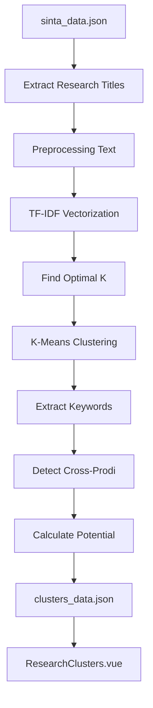

# Research Clustering: Metodologi & Flow

Dokumentasi lengkap tentang fitur **Kolaborasi Riset** yang menggunakan TF-IDF + K-Means Clustering untuk mengelompokkan penelitian berdasarkan kemiripan topik.

---

## 🎯 Tujuan Fitur

1. **Identifikasi Topik Serupa** - Mengelompokkan penelitian dengan tema yang mirip
2. **Deteksi Kolaborasi Cross-Prodi** - Menemukan area kolaborasi antara SI dan Bisnis Digital
3. **Prioritisasi Kolaborasi** - Menentukan potensi kolaborasi (High/Medium/Low)

---

## 📊 Flowchart Proses



---

## 🔧 Penjelasan Teknis

### Step 1: Extract Research Titles

Data diambil dari `sinta_data.json`, mengekstrak:
- **Penelitian** (`research[].title`)
- **Pengabdian** (`services[].title`)

Setiap item menyimpan: `title`, `author`, `prodi`, `type`, `year`

### Step 2: Preprocessing Text

```
Input:  "Implementasi Sistem Informasi Geografis untuk Pemetaan Kota Balikpapan"
Output: "geografis pemetaan kota balikpapan"
```

**Yang dihapus:**
- Lowercase semua teks
- Hapus karakter spesial
- Hapus stopwords Indonesia & Inggris (dan, di, untuk, using, based, dll)
- Hapus kata-kata umum penelitian (implementasi, sistem, metode, analisis, dll)

### Step 3: TF-IDF Vectorization

**TF-IDF** (Term Frequency - Inverse Document Frequency) mengkonversi teks menjadi vektor numerik.

```
Dokumen 1: "wisata balikpapan"     → [0.7, 0.5, 0.0, ...]
Dokumen 2: "wisata kaltim"         → [0.6, 0.0, 0.4, ...]
Dokumen 3: "sampah pengelolaan"    → [0.0, 0.0, 0.0, 0.8, 0.7, ...]
```

**Parameter:**
- `max_features=500` - Maksimal 500 kata unik
- `ngram_range=(1,2)` - Unigram dan bigram ("balikpapan", "kota balikpapan")

### Step 4: Find Optimal K (Jumlah Cluster)

Menggunakan **Silhouette Score** untuk menemukan jumlah cluster optimal.

```
K=4  → Score: 0.052
K=5  → Score: 0.061
K=6  → Score: 0.079 ← Optimal
K=7  → Score: 0.073
...
```

Score tertinggi = cluster paling koheren.

### Step 5: K-Means Clustering

Algoritma K-Means mengelompokkan dokumen berdasarkan kedekatan vektor TF-IDF.

```
Cluster 0: [Doc1, Doc5, Doc12, ...]  → Topik: Wisata
Cluster 1: [Doc2, Doc8, Doc15, ...]  → Topik: Sampah
Cluster 2: [Doc3, Doc7, Doc20, ...]  → Topik: IKN
...
```

### Step 6: Extract Keywords

Untuk setiap cluster, dihitung kata-kata yang paling sering muncul:

```
Cluster 0: Keywords = ["balikpapan", "wisata", "pariwisata", "destinasi", "objek"]
```

Top 5 keywords menjadi identitas cluster.

### Step 7: Detect Cross-Prodi

Cluster diperiksa apakah berisi dosen dari lebih dari 1 prodi:

```javascript
const prodis = new Set(cluster.items.map(i => i.prodi));
isCrossProdi = prodis.size > 1; // true jika ada SI + Bisdig
```

---

## 🏷️ Penjelasan Badge

### 1. Badge CROSS-PRODI (Hijau)

```
┌─────────────────┐
│   CROSS-PRODI   │  ← Badge hijau
└─────────────────┘
```

**Definisi:** Cluster yang berisi penelitian dari **KEDUA** program studi (SI + Bisnis Digital).

**Kenapa penting:** 
- Menunjukkan area yang sudah disentuh kedua prodi
- Potensi kolaborasi interdisipliner
- SI bawa teknis, Bisdig bawa perspektif bisnis

**Contoh:**
```
Cluster: "Balikpapan & Media & Peningkatan"
- Dosen A (SI): "Sistem Informasi Pemasaran UMKM Balikpapan"
- Dosen B (BD): "Strategi Media Sosial untuk UMKM Balikpapan"  
→ CROSS-PRODI = TRUE
```

### 2. Badge Collaboration Potential

| Badge | Kondisi | Arti |
|-------|---------|------|
| 🔥 **High** | Cross-Prodi + >2 dosen | Kolaborasi sangat mungkin, banyak pihak terlibat |
| ✨ **Medium** | Cross-Prodi + ≤2 dosen | Ada potensi, tapi perlu lebih banyak pengembangan |
| 📌 **Low** | Single Prodi | Topik hanya disentuh 1 prodi, perlu ekspansi |

**Logika:**
```javascript
if (isCrossProdi && uniqueAuthors > 2) {
  potential = 'high';
} else if (isCrossProdi) {
  potential = 'medium';  
} else {
  potential = 'low';
}
```

---

## 🗂️ Struktur Output (clusters_data.json)

```json
{
  "metadata": {
    "generatedAt": "2024-02-02T...",
    "algorithm": "TF-IDF + K-Means",
    "totalItems": 229,
    "totalClusters": 12
  },
  "clusters": {
    "0": {
      "id": 0,
      "name": "Balikpapan & Kota & Timur",
      "keywords": ["balikpapan", "kota", "timur", "kalimantan", "wilayah"],
      "items": [
        {
          "title": "Analisis Potensi Wisata Kota Balikpapan",
          "author": "Dr. Nama Dosen",
          "prodi": "Sistem Informasi",
          "type": "Penelitian",
          "year": "2023"
        }
      ],
      "count": 52,
      "prodis": ["Sistem Informasi", "Bisnis Digital"],
      "authors": ["Dosen A", "Dosen B", "Dosen C"],
      "isCrossProdi": true,
      "collaborationPotential": "high"
    }
  },
  "summary": {
    "crossProdiCount": 11,
    "highPotentialCount": 11,
    "topClusters": [...]
  }
}
```

---

## 🔄 Cara Re-run Clustering

Setelah melakukan scraping SINTA baru, jalankan:

```bash
python scripts/research_clustering.py
```

Output akan diperbarui di `src/data/clusters_data.json`.

---

## 📈 Use Cases untuk Kepala Lab

| Use Case | Action |
|----------|--------|
| **Proposal Hibah Kolaboratif** | Pilih cluster High Potential, identifikasi dosen dari SI + BD |
| **Research Roadmap** | Lihat topik yang sudah banyak digarap vs yang masih sepi |
| **Team Building** | Matching dosen dengan topik serupa untuk joint publication |
| **Gap Analysis** | Temukan area yang hanya disentuh 1 prodi (Low Potential) |
