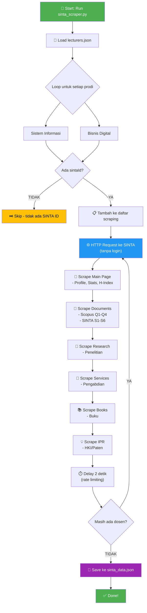
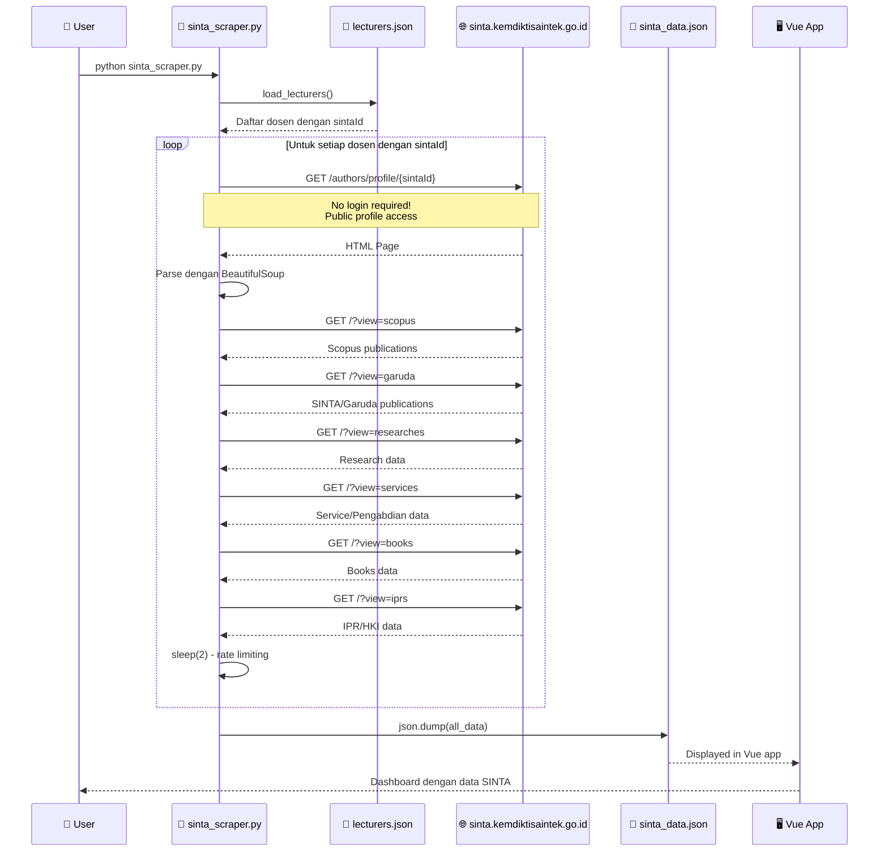

# Analisis Data Flow SINTA Scraper

## 📋 Ringkasan

Berdasarkan analisis codebase, **YA, script SINTA scraper akan menarik data untuk SEMUA dosen yang didaftarkan**, tidak hanya satu prodi saja. Script ini mengambil data publik dari SINTA **TANPA PERLU LOGIN**, karena profil SINTA sifatnya terbuka dan dapat diakses secara publik.

---

## 🔑 Jawaban Pertanyaan Anda

### Apakah Semua Akun yang Didaftarkan Akan Ditarik Datanya?

**YA**, dengan syarat:
1. Dosen tersebut memiliki `sintaId` yang valid di file `lecturers.json`
2. Profil SINTA dosen tersebut dapat diakses secara publik

### Apakah Perlu Login ke SINTA?

**TIDAK perlu login**. Script menggunakan **web scraping** untuk mengakses halaman profil publik SINTA:
- URL: `https://sinta.kemdiktisaintek.go.id/authors/profile/{SINTA_ID}`
- Akses dilakukan sebagai visitor biasa (tanpa autentikasi)

---

## 🔄 Flow Diagram: Proses Pengambilan Data SINTA



---

## 📁 Struktur File dan Hubungannya

```
📁 presentasi-laboratorium-inovasi-digital/
├── 📁 scripts/
│   └── 📄 sinta_scraper.py          ← Script untuk scraping
│
├── 📁 src/
│   ├── 📁 data/
│   │   ├── 📄 lecturers.json        ← INPUT: Daftar dosen + SINTA ID
│   │   └── 📄 sinta_data.json       ← OUTPUT: Hasil scraping
│   │
│   ├── 📁 components/
│   │   └── 📄 ProdiSelector.vue     ← UI untuk memilih prodi
│   │
│   ├── 📁 services/
│   │   └── 📄 serpApi.js            ← Service untuk Google Scholar API
│   │
│   └── 📄 App.vue                   ← Main Vue component
│
└── 📄 server.js                     ← Backend server
```

---

## 📊 Alur Data Lengkap (Sequence Diagram)



---

## 🔍 Dosen yang Akan Di-Scrape

### ✅ Prodi Sistem Informasi (15 dosen dengan SINTA ID)

| No | Nama | SINTA ID | Status |
|----|------|----------|--------|
| 1 | Yuyun Tri Wiranti | 5978281 | ✅ Akan di-scrape |
| 2 | Aidil Saputra Kirsan | 6760340 | ✅ Akan di-scrape |
| 3 | Arif Wicaksono Septyanto | 6741019 | ✅ Akan di-scrape |
| 4 | Henokh Lugo Hariyanto | 6807418 | ✅ Akan di-scrape |
| 5 | Lovinta Happy Atrinawati | 5977894 | ✅ Akan di-scrape |
| 6 | Vika Fitratunnany Insanittaqwa | 6784235 | ✅ Akan di-scrape |
| 7 | Hendy Indrawan Sunardi | 6784468 | ✅ Akan di-scrape |
| 8 | Dwi Nur Amalia | 6761367 | ✅ Akan di-scrape |
| 9 | Dwi Arief Prambudi | 6784358 | ✅ Akan di-scrape |
| 10 | I Putu Deny Arthawan S.P. | 6701825 | ✅ Akan di-scrape |
| 11 | M. Ihsan Alfani Putera | 6681873 | ✅ Akan di-scrape |
| 12 | Sri Rahayu Natasia | 5983406 | ✅ Akan di-scrape |
| 13 | Nursanti Novi Arisa | 6757976 | ✅ Akan di-scrape |
| 14 | Rosa Eliviani | 6876629 | ✅ Akan di-scrape |
| 15 | M. Gilvy Langgawan Putra | 6201079 | ✅ Akan di-scrape |

### ⚠️ Prodi Bisnis Digital (0 dosen dengan SINTA ID)

| No | Nama | Status |
|----|------|--------|
| 1 | Agung Prabowo | ❌ Skip - tidak ada SINTA ID |
| 2 | Bayu Nur Abdallah | ❌ Skip |
| 3 | Deli Yansyah | ❌ Skip |
| 4 | Eka Krisna Santoso | ❌ Skip |
| 5 | Khairunnisa Rahmah | ❌ Skip |
| 6 | Muhammad Ikhsan Alif S | ❌ Skip |
| 7 | Prasis Damai Nursyam H. | ❌ Skip |
| 8 | Luh Made Wisnu S. | ❌ Skip |

---

## 📝 Cara Menambah Dosen Baru

Edit file `src/data/lecturers.json`:

```json
{
    "name": "Nama Dosen Baru",
    "scholarId": "GOOGLE_SCHOLAR_ID",
    "scholarUrl": "https://scholar.google.com/citations?user=...",
    "sintaId": "SINTA_ID_DISINI",  // ← Wajib ada untuk SINTA scraping
    "sintaUrl": "https://sinta.kemdiktisaintek.go.id/authors/profile/SINTA_ID"
}
```

---

## 🔧 Cara Menjalankan Scraper

```bash
cd scripts
python sinta_scraper.py
```

**Output:** `src/data/sinta_data.json`

---

## ⚡ Data yang Diambil per Dosen

```json
{
  "name": "Nama Dosen",
  "sintaId": "1234567",
  "prodi": "Sistem Informasi",
  "stats": {
    "articles": 40,
    "citations": 473,
    "hIndex": 8,
    "scopusArticles": 6,
    "googleArticles": 40
  },
  "documents": {
    "scopus": { "q1": 0, "q2": 1, "q3": 0, "q4": 3, "total": 6 },
    "sinta": { "s1": 0, "s2": 0, "s3": 0, "s4": 5, "total": 8 }
  },
  "research": [...],
  "services": [...],
  "books": [...],
  "ipr": { "hakCipta": 0, "paten": 0 }
}
```

---

## ⚠️ Catatan Penting

- **Rate Limiting**: 2 detik delay antar request
- **Timeout**: 30 detik per request
- **Akses Publik**: Tidak memerlukan login SINTA
