# 💻 Solusi Development Environment: GitHub Codespaces untuk Dosen FSTI-ITK
*"Laptop 8GB RAM Penuh? Pakai Cloud Computer Gratis!"*

---

## 🤔 Apa itu GitHub Codespaces?

Bayangkan punya **komputer development di cloud** yang powerful, sementara laptop Anda tetap ringan untuk task lainnya.

### 🔍 **Problem yang Real:**

### ✅ **Solusi Codespaces:**

```mermaid
flowchart LR
    A[💻 Laptop 8GB<br/>tetap ringan] --> B[🌐 Internet] --> C[☁️ Cloud Computer<br/>8-64GB RAM]
    
    D[📧 Email, Office] --> A
    E[🎥 Zoom, Browser] --> A
    F[💻 Heavy Development] --> C
    
    style A fill:#e1f5fe
    style C fill:#c8e6c9
```

---

## 🎯 Cara Daftar GitHub Education

### Step-by-Step:

```mermaid
flowchart TD
    A[🌐 Buka github.com] --> B[👤 Daftar akun GitHub]
    B --> C[⚙️ Settings → Billing]
    C --> D[🎓 Education Benefits]
    D --> E[👨‍🏫 Select: Teacher]
    E --> F[📤 Upload SK mengajar ITK]
    F --> G[📋 Lengkapi form]
    G --> H[📨 Submit application]
    H --> I[⏳ Tunggu 3-7 hari]
    I --> J{✅ Approved?}
    J -->|Yes| K[🎉 GitHub Pro FREE activated]
    J -->|No| L[📧 Perbaiki dokumen & resubmit]
    
    style K fill:#c8e6c9
    style L fill:#ffcdd2
```

### Dokumen yang Diperlukan:
| 📄 **Required** | ✅ **Format** | 💡 **Tips** |
|---|---|---|
| **Email ITK** | @itk.ac.id | Wajib email institusi |
| **SK Mengajar** | PDF scan jelas | Dokumen resmi ITK |
| **Foto KTP** | JPG/PNG | Readable & valid |

---

## 🎁 Benefits yang Didapat Teacher

### ✅ **GitHub Education Teacher Benefits:**

### 📊 **Value Comparison:**
| **Service** | **Regular Price** | **Teacher Benefit** | **Savings** |
|---|---|---|---|
| GitHub Pro | $4/month | **FREE** | $48/year |
| Copilot Pro | $20/month | **FREE** | $240/year |
| Codespaces | Pay-per-use | **Enhanced allowance** | $50-100/year |
| **Total** | **$288/year** | **$0** | **💰 $288-388/year** |

---

## 💡 Codespaces untuk 8 Prodi ITK

### **Coverage untuk Semua Program Studi:**

```mermaid
flowchart TB
    subgraph "🖥️ COMPUTING PRODI"
        A[Sistem Informasi]
        B[Informatika]
        C[Bisnis Digital]
    end
    
    subgraph "⚡ ENGINEERING PRODI" 
        D[Teknik Elektro]
        E[Fisika]
    end
    
    subgraph "📊 ANALYTICS PRODI"
        F[Matematika]
        G[Statistika]
        H[Ilmu Aktuaria]
    end
    
    A --> I[Web Development<br/>Database Systems<br/>Software Engineering]
    B --> J[Programming Fundamentals<br/>AI/ML<br/>Mobile Development]
    C --> K[Digital Analytics<br/>E-Commerce Dev<br/>Business Intelligence]
    
    D --> L[Signal Processing<br/>IoT Programming<br/>Control Systems]
    E --> M[Scientific Computing<br/>Simulation<br/>Data Analysis]
    
    F --> N[Numerical Methods<br/>Mathematical Modeling<br/>Algorithm Design]
    G --> O[Statistical Computing<br/>Data Visualization<br/>R/Python Analytics]
    H --> P[Risk Modeling<br/>Financial Analytics<br/>Actuarial Computing]
```

### **Mata Kuliah yang Cocok per Kategori:**

| 🎯 **Kategori** | 📚 **Mata Kuliah Examples** | 🛠️ **Tools Available** |
|---|---|---|
| **Programming Fundamentals** | Algoritma, Struktur Data, OOP | Python, Java, C++, debugger |
| **Web & Mobile Development** | Frontend, Backend, Mobile Apps | HTML/CSS/JS, React, Flutter, Node.js |
| **Data Science & Analytics** | Data Mining, Visualization, ML | pandas, numpy, matplotlib, scikit-learn |
| **Scientific Computing** | Numerical Methods, Simulation | SciPy, mathematical libraries |
| **Database & Systems** | Database Design, SQL, NoSQL | PostgreSQL, MongoDB, MySQL |
| **Engineering Applications** | Signal Processing, IoT, Control | MATLAB alternatives, embedded tools |

---

## ⚡ Spesifikasi & Environment

### **Machine Types Available:**

### **Pre-installed Development Stack:**
| **Category** | **Tools & Libraries** |
|---|---|
| **Languages** | Python 3.x, JavaScript/Node.js, Java, C/C++, Go, PHP, Ruby |
| **Data Science** | NumPy, pandas, SciPy, Matplotlib, seaborn, Plotly |
| **Machine Learning** | scikit-learn, TensorFlow, PyTorch, Keras |
| **Web Development** | React, Vue.js, Express, Django, Flask |
| **Database** | PostgreSQL, MySQL, MongoDB, SQLite |
| **Development Tools** | Git, Docker, VS Code extensions, Jupyter |

---

## 📚 Implementation Workflow

### **Teaching Workflow:**

### **Development Cycle:**

```mermaid
graph TD
    A[💡 Idea/Assignment] --> B[🚀 Launch Codespace]
    B --> C[⚡ Instant Environment]
    C --> D[💻 Code & Develop]
    D --> E[🧪 Test & Debug]
    E --> F[🔄 Collaborate/Review]
    F --> G[📤 Submit/Deploy]
    G --> H[💾 Archive/Stop Codespace]
    
    H -.->|Next project| A
    
    style C fill:#c8e6c9
    style H fill:#ffecb3
```

---

## 🚨 Realistic Limitations & Solutions

### **Limitations Analysis:**

### **Limitation vs Solution Matrix:**
| ❌ **Limitation** | 🔄 **Hybrid Solution** | 💡 **Best Practice** |
|---|---|---|
| **Internet dependent** | Local backup + sync | Stable connection planning |
| **No GPU (free tier)** | Google Colab, Kaggle | Hybrid ML workflow |
| **Auto-shutdown on idle** | Save work frequently | Use Git consistently |
| **Storage limits** | Cloud storage integration | External data repos |
| **Learning curve** | Start small, scale up | Begin with simple projects |

---

## 💰 Resource Management Strategy

### **Monthly Usage Optimization:**

### **Cost-Effective Practices:**
| 💡 **Strategy** | 📊 **Impact** | ⏱️ **Implementation** |
|---|---|---|
| **Stop unused codespaces** | Save 60-80% hours | Auto-timeout settings |
| **Right-size machines** | Save 50% costs | Match spec to task |
| **Batch similar tasks** | Optimize usage | Schedule coding sessions |
| **Template reuse** | Save setup time | Create course templates |

---

## 💬 FAQ Berdasarkan 8 Prodi ITK

**Q: Cocok untuk semua prodi teknik?**  
A: Ya, dari programming dasar sampai scientific computing tersedia

**Q: Mahasiswa statistika bisa pakai R?**  
A: Bisa install R, atau pakai RStudio Cloud integration

**Q: Untuk prodi bisnis digital gimana?**  
A: Perfect untuk web development, data analytics, e-commerce projects

**Q: Teknik elektro bisa simulasi?**  
A: Bisa untuk software simulation, hardware simulation perlu tools khusus

**Q: Replace lab komputer kampus?**  
A: Complement, bukan replace. Hybrid approach terbaik

---

📧 Untuk pertanyaan lebih lanjut, hubungi: [Aidil Saputra Kirsan - Kepala Lab Inovasi Digital FSTI ITK](https://aidilsaputrakirsan.github.io)
🚀 **Start here:** [education.github.com](https://education.github.com)